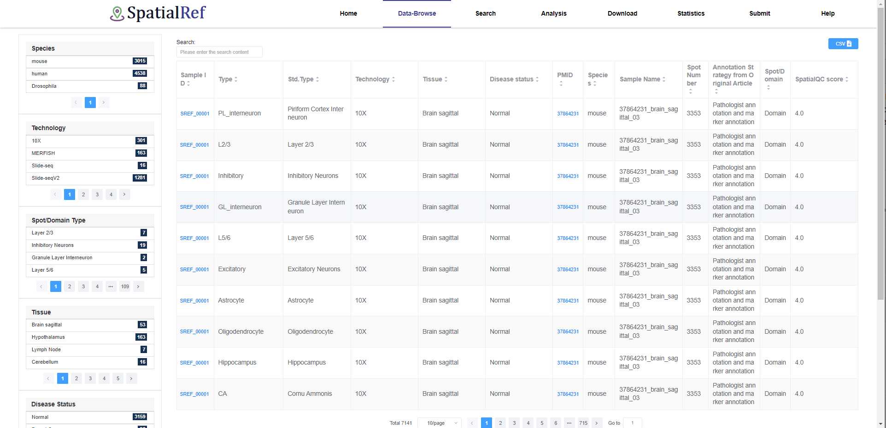

3.How to use the SpatialRef?
~~~~~~~~~~~~~~~
3.1.Data-Browse
^^^^^^^^^^^^^^^^^^^^^
The “Data-Browser” page adopts an interactive, alphanumeric-sorted table format. The browser table displays Sample ID, Known Spot/Domain Type, Technology, Tissue, PMID, Disease status, Species, Sample Name, and Spot Number, Annotation strategy from Original Article, Spot/Domain. Users can quickly search samples and customize filter criteria through “Species”, “Technology”, “Tissue”, “Disease Status”, “Spot/Domain”, “SpatialQC score” and “Known Spot Type”. Users can use the dropdown menu at the bottom of the table to change the number of entries displayed per page. Simply clicking on the “Sample ID” allows users to view the detailed information of a given sample.

