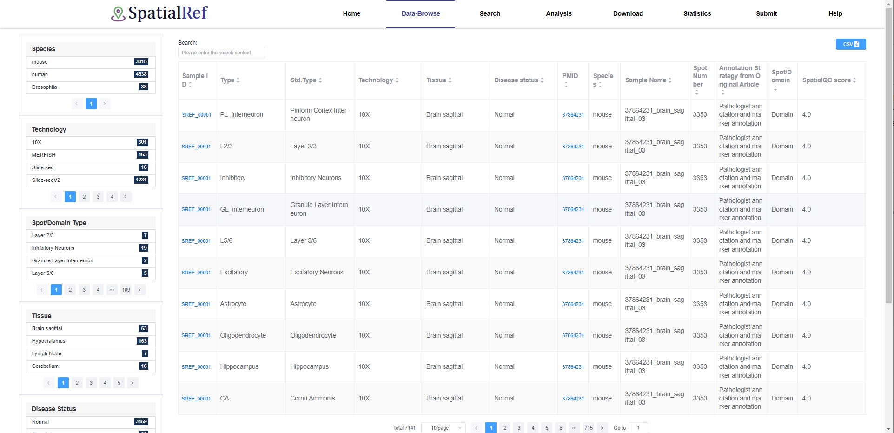
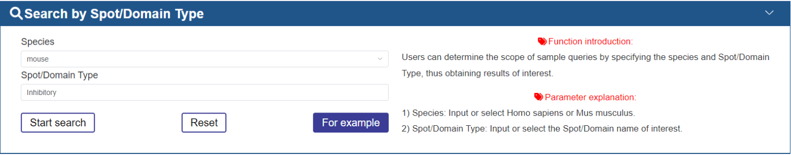
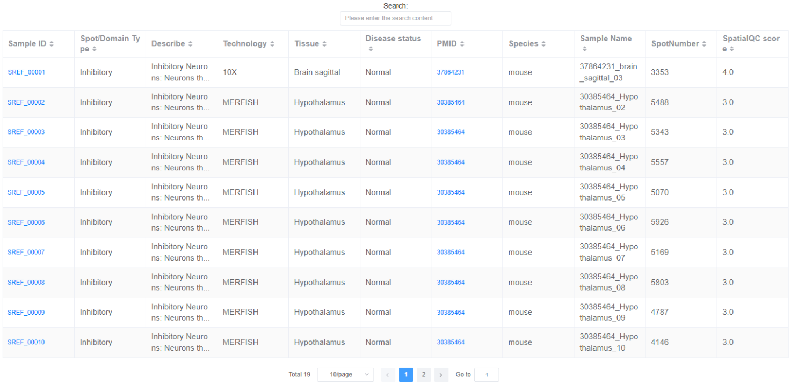

HELP2.0
============

1.What information is available in SpatialRef?
~~~~~~~~~~~~~~~

Spatial omics can capture molecular characteristics, tissue morphology, spatial locations, and the three-dimensional proximity of biological entities, making it possible to create detailed spatial maps and blueprints. Accurate cell type annotation of these spatial spots and domains is a fundamental task in cell and tissue biology. This is crucial for various downstream analyses in spatial omics research. Here, we have developed a SpatialRef 
`(https://bio.liclab.net/spatialref/) <https://bio.liclab.net/spatialref/>`_, a manually curated spatial omics database. SpatialRef provides expertly annotated spatial omic data and integrates diverse functions for analyzing and displaying the spatial information related to spots or tissues. SpatialRef analyzes these manually annotated spot types to identify and display spot type-specific marker genes, perform GO and KEGG pathway enrichment, explore spatial communication, and spatial trajectory.

2.Data Content in SpatialRef?
~~~~~~~~~~~~~~~
The current version of SpatialRef aggregates approximately 3 million spots across 11 human and mouse tissue types, further categorized into 182 spot types or spatial domains. These data originate from multiple platforms, including NCBI, HCA, EMBL-EBI, GitHub, and Zenodo, and cover technologies such as MERFISH, 10X Visium, Slide-seq, Slide-seqV2, ST, seqFISH, and CODEX. Notably, the known spot types within SpatialRef adhere to original paper annotations, ensuring accuracy and reliability. Additionally, SpatialRef analyzes these manually annotated spot types to identify and display spot type-specific marker genes, perform GO and KEGG pathway enrichment, explore spatial communication, and spatial trajectory.

3.How to use the SpatialRef?
~~~~~~~~~~~~~~~
3.1.Data-Browse
------------------
The “Data-Browser” page adopts an interactive, alphanumeric-sorted table format. The browser table displays Sample ID, Known Spot/Domain Type, Technology, Tissue, PMID, Disease status, Species, Sample Name, and Spot Number, Annotation strategy from Original Article, Spot/Domain. Users can quickly search samples and customize filter criteria through “Species”, “Technology”, “Tissue”, “Disease Status”, “Spot/Domain”, “SpatialQC score” and “Known Spot Type”. Users can use the dropdown menu at the bottom of the table to change the number of entries displayed per page. Simply clicking on the “Sample ID” allows users to view the detailed information of a given sample.

3.2.Search
------------------
We design three search models, including Search by Spot/Domain Type , Search by Technology and Search by Disease Status.

3.2.1 Search by SpotType
^^^^^^^^^^^^^^^^^^^^^
In the Search by Spot Type mode, users can determine the scope of sample queries by specifying the species and spot/domain type, thus obtaining results of interest.

The brief information on the search results is displayed in a table on the result page. The table describes the Sample ID, Known Spot Label, Technology, etc. Users can click the Sample ID to view the details about each sample.

In the detailed page of sample, we will display the detailed information of sample and known spot type, including the source and description of literature, etc.

.. image:: ../Search2.jpg
   :align: center
   :alt: Browse

Contents
--------

.. toctree::
   information
   data
   use
   browse
   search
   usage
   api
