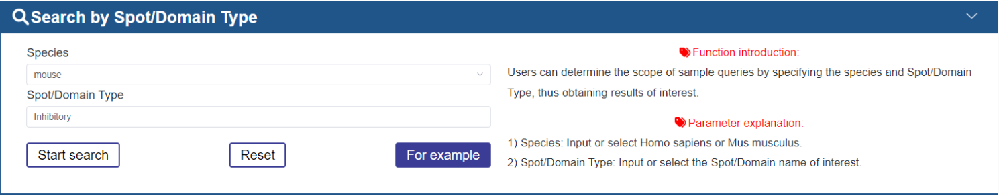
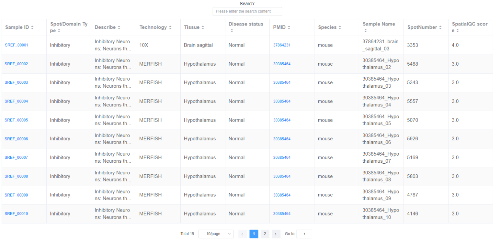

3.How to use the SpatialRef?
~~~~~~~~~~~~~~~
3.1.Data-Browse
------------------
The “Data-Browser” page adopts an interactive, alphanumeric-sorted table format. The browser table displays Sample ID, Known Spot/Domain Type, Technology, Tissue, PMID, Disease status, Species, Sample Name, and Spot Number, Annotation strategy from Original Article, Spot/Domain. Users can quickly search samples and customize filter criteria through “Species”, “Technology”, “Tissue”, “Disease Status”, “Spot/Domain”, “SpatialQC score” and “Known Spot Type”. Users can use the dropdown menu at the bottom of the table to change the number of entries displayed per page. Simply clicking on the “Sample ID” allows users to view the detailed information of a given sample.

.. image:: ../Browse.png
   :align: center
   :alt: Browse
3.2.Search
------------------
We design three search models, including Search by Spot/Domain Type , Search by Technology and Search by Disease Status.

3.2.1 Search by SpotType
^^^^^^^^^^^^^^^^^^^^^
In the Search by Spot Type mode, users can determine the scope of sample queries by specifying the species and spot/domain type, thus obtaining results of interest.

The brief information on the search results is displayed in a table on the result page. The table describes the Sample ID, Known Spot Label, Technology, etc. Users can click the Sample ID to view the details about each sample.

In the detailed page of sample, we will display the detailed information of sample and known spot type, including the source and description of literature, etc.

